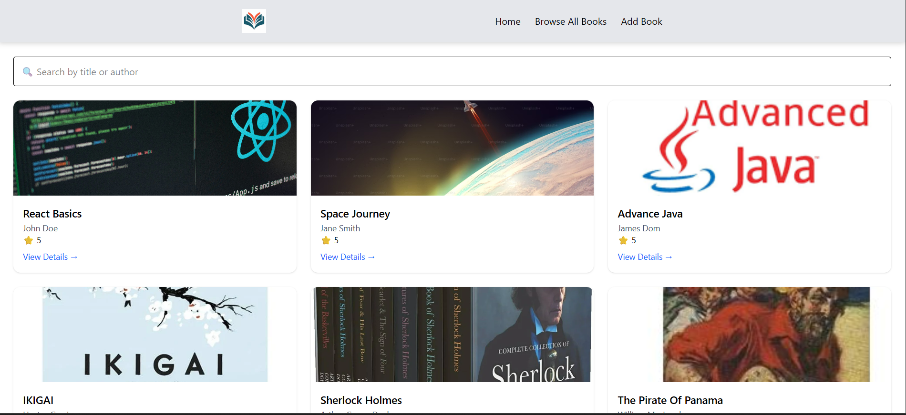

# 📚 Online Library System (React + Vite)



An online library system built using **React**, **Vite**, **React Router**, and **Redux**.  
This project is created as part of **React Assignment 2**.

---

## 🚀 Features

- Home page with welcome message and book categories
- Browse books by category using dynamic routing
- Search books by title or author
- View detailed information of a book
- Add new books using Redux state management
- Form validation while adding books
- 404 Page Not Found handling
- Responsive and user-friendly UI

---

## 🛠️ Tech Stack

- React
- Vite
- React Router DOM
- Redux Toolkit
- React Redux
- Tailwind CSS / CSS

---

## 📦 Installation & Setup

Follow the steps below to run the project locally.

### 1️. Clone the Repository
```bash
git clone https://github.com/jayesh-shendurnikar-2001/online-book-library.git

2. Install Dependencies

3. Start Development Server